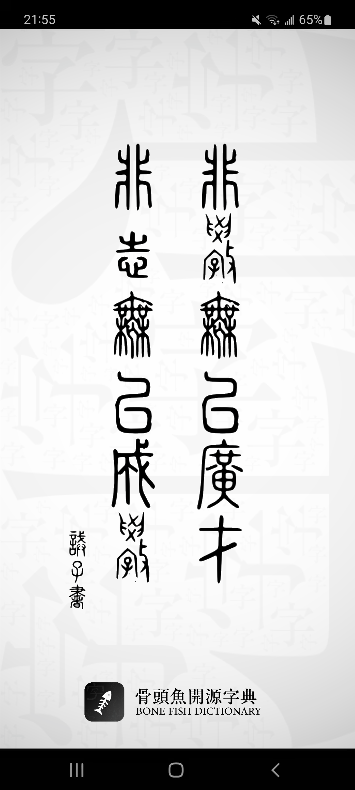
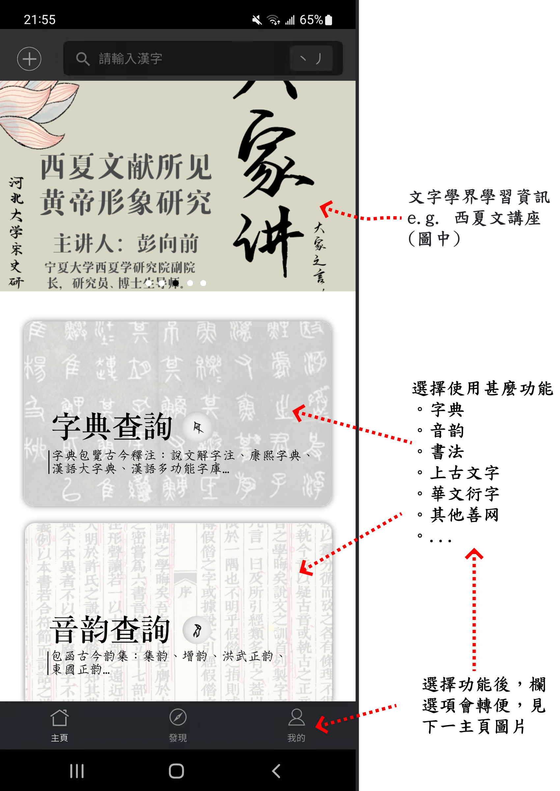
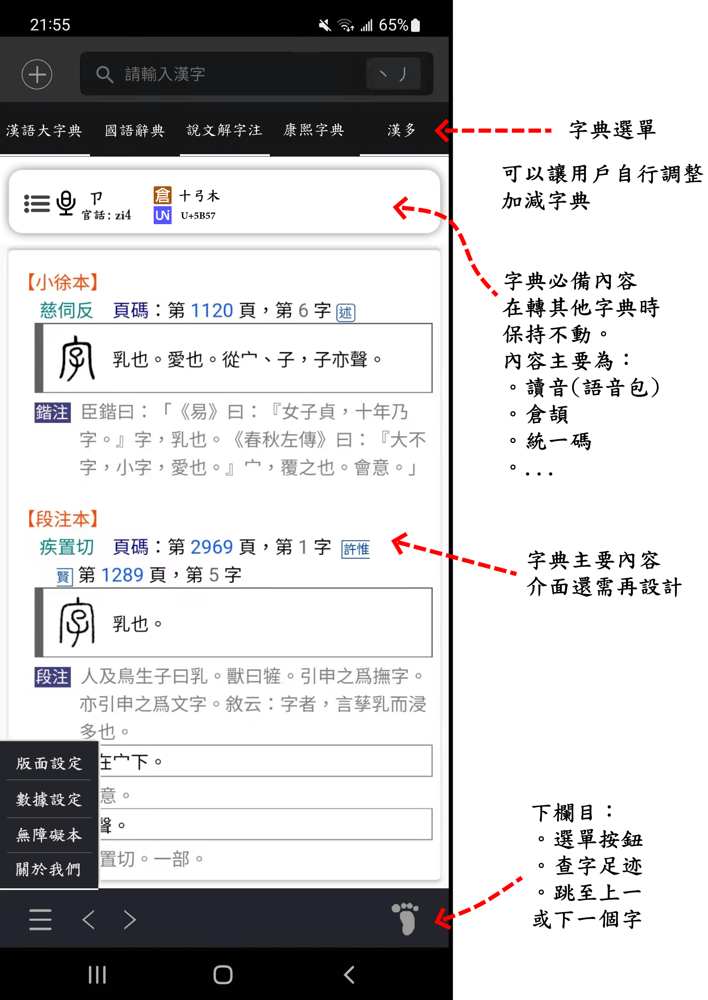
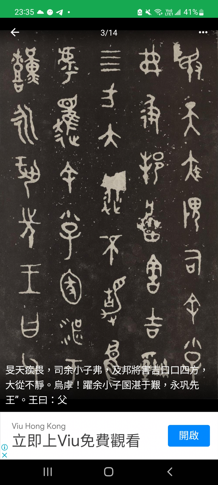

# 骨頭魚開源免費字典

<hr></hr>


#### 字典開發主要以 Flutter(前端語言)及 midwayjs(後端語言)。

#### ：：總覽目標：：

- **字詞查詢：**
  - 華夏文字
  - 上古、異國、境內族群、華文衍伸之漢字

- 提供多種查詢方法 ( 拼音、筆劃、統一碼Unicode等 )

- 提供書法、各地方言、音韵、字詞關聯性功能等

- 目標對像不限

  - 文字學新手入門工具
  - 文字學專家重要查詢工具


- 典內文字雙擊查詢功能


- **介面管理：**

  - 可自行選擇字常用字典首設

  - 內容可以【直立式】或【分立式】展示

  - 允許自行調整介面

  - 提供【日間】、【夜間】、【舊素典】視覺模式

  - 考慮增設外掛功能：瀏覽器擴充軟件 (桌面用戶)

    - 優秀程式例子：Saladict

    

- **數據管理：**

  - 提供數據包 ( 語音、字典內容、書法等 )下載
    - 下載自裝，可以離線查詢

  - 數據共享
  - AI數據管理。文字關聯性等
  - 無障礙版本

  

- **更多功能：**

  - 增設知識區 >> 每日一字
  - 文學討論區
  - 提供講座資訊
  - 特設【閱讀器】( pdf, mdx 等 )
    - 主要供學者閱讀古籍
    - 提供更方便的【古籍文件管理系統】和【閱讀介面】。
    - 開源字典或可提供古籍下載，或用戶自行導入外來文件。

  - 提供 .ttf 字體推介 ( BabelStone, 明朝體等 )
  - OCR古籍內容掃描，文件電子化。
  - 繁簡轉換工具
  - 古韵平仄查詢
  - AI 數據分析 ( 將來考慮 )
  - 省誌名字(人名、地名等) 導航

  

- **其他：**

  - 最低支持版本？


<br><br><br>
--------------------------------------------------------------------

## 字典介面意想圖



↑ 可以在進入界面，引導用戶進行起始設定(Initialize)，比如選擇甚麼字典、界面風格、加入交流等基本設置。





↑ 詳見上方右側解述

<br><br>

## 字詞查詢

目前已知華夏文字

```
夏陶符號(夏篆) ~ 周篆

甲骨文 -- 商代四代征軍 民少字遺 後占卜復取 撰龜殼甲被之上
周武王尚夏篆 其文字成熟規笵 筆道圓潤 甲文與之相徑庭 俗字繁多

六體：古文、奇字、篆、隸、繆篆、蟲書

隸、楷、行草、狂草、草隸、郭煌俗字、石璧(碑刻)、合體字、爨體字、北朝俗字、道教用字、則天文字、(異體字 異寫字 異構字)

日本運步色葉集(堪比敦煌文字)
-- ref 京東大學圖書館 (第一冊)
https://rmda.kulib.kyoto-u.ac.jp/item/rb00013243#?c=0&m=0&s=0&cv=0&r=0&xywh=-4623%2C-115%2C12317%2C2275

異國漢字：
-- 喃字, 儒字 (越南)
-- 琉球漢字 (琉球)
-- 日韓漢字

上古。境內民族族文字：
-- 水書 ( 殄文.水族文字)
-- 東巴文(納西族文字)
   。 西藏東部, 云南北部
   。 麼些象形文字字典 — 李霖燦
   。 納西象形文字譜 — 方國瑜 和志武　
-- 壯字
-- 彝文
   。 ref: 彝學研究网 http://www.yixueyanjiu.com/total.jsp?class=21&subsort=%E5%9C%A8%E7%BA%BF%E5%8F%A4%E5%BD%9D%E6%96%87%E8%AF%8D%E5%85%B8

華文衍字：
-- 西夏、女書、契丹、女真
-- ref: 古今文字集成

特殊字：
-- 科學用字 
   。 e.g. 瓩, 糎, 竰 
   。 ref: https://www2.zhihu.com/question/311219380
-- 訛俗字, 大藏經訛俗字 (中國,日本來源)
-- 偽漢英體 (徐冰. 析世鑒天書) (當代作家)
   。 ref: http://www.xubing.com/cn
-- 類化字(e.g. 餓, ⿰食⿱人我)
-- 避諱字
-- 減字譜(曲譜造用)
```

#### 加入內容基本可以從 github HanZiUrl 連結搜查

#### 有文學朋友建議：古代文獻( e.g. 地方志 )中詞語收錄釋讀為少，可以考慮增加補充

**文字搜索功能**

- 筆劃、倉頡、九筆、Unicode等查詢方法 ( 看看github有沒有前人已製工具 )

**漢字圖文**

- 甲金文之類
- 書法ref. 書法大師, zi.tools

**字典包覽**

- 漢字基本釋義
- 【↑目前已知華夏文字↑】 所提及的文字查詢
- 字典包覽古今釋注：說文解字注、康熙字典、漢語大字典
  - 說文 => 考慮補今釋白話本說文 ( OCR? 與出版聯繫? ... )
- 今人對古漢字釋讀
  - 漢語多功能字庫
  - 甲骨文今釋
- 對文字本義給予額外解說，圖片說明。
- 提供閱讀繁簡版本

**音韵語系** 

- 古籍字典 — 包函古今韵集：集韵、增韵、洪武正韵、東國正韵...

- 今人對中古上古音韻鑽研

- 方言查詢

** 需要向專家咨詢。個人可能會向學校搜集資料 

**字典內容文字雙擊查詢功能**

- 見此功能於【國語工作室辭典】、【Saladict】提供，值得參考

#### 古碑文查詢閱讀



↑ 圖片+文字釋讀

- 可以讓初學者接觸石碑銘文
- 學者可以直接查詢
- 例子：史墻盤、蒼頡篇、毛公鼎等...

<br><br>

## 介面管理

#### 目前意想圖所用電腦字體

- 老報宋、康熙字體

- 華康徽宗宮體W5(P)

*希望可以再簡化，造就方便靈活的字典

#### 外掛程式

-  考慮可以編造瀏覽器extension

- 讓用戶直接雙擊字詞查核

- 參考 saladict

#### 設定

- 可自選上架字典，去除不常用的字典
- 整體字體排放
  - **直立式：**所有電子化字典，由上至下排列，全部展示於一頁中
  - **分立式：**各個字典獨立分成不同Section，讓用戶自行滑動轉換

- 允許自行調整介面 ( 續後再處理 )

- 提供【日間】、【夜間】、【舊素典】視覺模式 ( 或更多顏色轉換 )

- 考慮增設外掛功能：瀏覽器擴充軟件 (桌面用戶)

  - 優秀程式例子：Saladict

#### 數據管理

- 提供離線數據包下載
  - 字典包、書法包、語音包等
- 無障礙版本 

#### 功能

- 知識區：
  - 每日一字 / 隨緣會字
  - 字源分享
- 文學討論區
- 提供講座資訊 ( 漢學网站連結等。文學公眾號 )
- 特設【閱讀器】( pdf, mdx 等 )
  - 主要供學者閱讀古籍
  - 提供更方便的【古籍文件管理系統】和【閱讀介面】。
  - 開源字典或可提供古籍下載，或用戶自行導入外來文件。
- 提供 .ttf 字體推介 ( BabelStone, 明朝體等 )
- OCR古籍內容掃描，文件電子化。
- 繁簡轉換工具
- 古韵平仄查詢
- AI 數據分析 ( 將來考慮 )
- 地理志、省誌名字(人名、地名等) 導航
- 推荐善頁善网

#### 持續發展

- 政府補貼項目
- 線上線下版本更新
- 支援手機可下載最低版本
- 更多電子化字典、碑文、書籍加入
